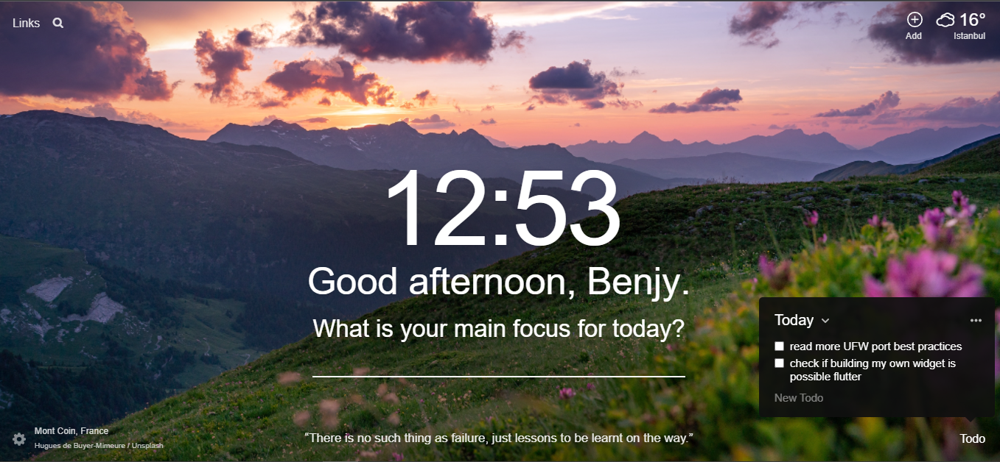

# Javascript_Mastery
the purpose of this Project is to practice javascript, we would try to replicate something like this, it is a Chrome extension, Momentum, shows the time and the Images changes.

for Our version, on loading, it would show Good Morning or Afternoon or Evening and it allows you to Enter your name, when you enter the name, it would be saved in the Browsers local storage, so when the page is been reloaded, you the name would be retained. 

in the images folder there is morning.jpg, afternoon.jpg and evening.jpg, the website background would change according to the time of the day.

things to learn from this Exercise 

1. Javascript DOM
2. dynamically change Background in html
3. local storage usage
4. basics of using git and github

# TODO
- [ ] Fork the repository to your personal github account
- [ ] Clone the forked version to your computer
- [ ] start coding and don't forget to make commits and push to github repo soe significant updates

Happy Codding !!!

